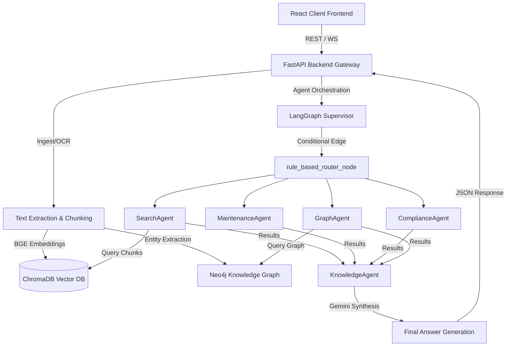

# System Architecture & Flow

This document details the software design, agent topologies, and databases powering **IndusMind AI**.

---

## 🏗 High-Level System Architecture

---

## 📊 Database Topologies
- **ChromaDB Vector Index**: Uses the `sentence-transformers/all-MiniLM-L6-v2` / `BAAI/bge-small-en-v1.5` embeddings to perform semantic text matching over chunked industrial manuals.
- **Neo4j Graph Database**: Implements a property-graph schema where engineering components are node entities (`IndustrialNode`) and relationships map engineering linkages (`RELATED_TO`, `PART_OF`, `MAINTAINED_BY`).

---

## 🤖 Multi-Agent Logic Flow (LangGraph)
1. **Router Node**: Evaluates user query intent using rule-based keyword mapping. Selects a combination of specialist agents (`SearchAgent`, `GraphAgent`, `MaintenanceAgent`, `ComplianceAgent`).
2. **Specialist Processing**:
   - `SearchAgent`: Queries vector space for semantic contexts.
   - `GraphAgent`: Traverses Neo4j nodes within 2 hops of matching entities.
   - `MaintenanceAgent`: Scans for mechanical failure signatures.
   - `ComplianceAgent`: Verifies compliance rules.
3. **Synthesis Node**: Passes all gathered contexts to the LLM (`gemini-pro-latest` or `gemini-flash-latest`) for precise, citation-backed response generation.
